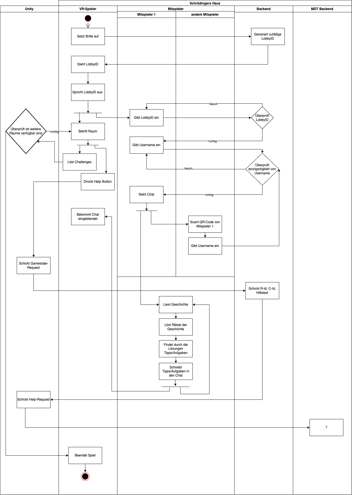

# Schrödingers Haus

Ein Virtual Reality Escape Room mit Website Multiplayer-Funktion. Der VR Spieler soll ein spannendes Spielerlebnis haben, bei welchem den Zuschauern die Möglichkeit angeboten wird, diesen auf ihren Smartphones zu unterstützen

## Team
 
Abazovic Emina, Aschenberger Maria (Scrum Master), Böhm Sophie, Stieg Seppi

## Projektantrag

## 1. Ausgangslage 

### 1.1. Ist-Situation 

Der VR Escape Room ist eine Diplomarbeit aus dem Jahr 2023, die von uns verbessert und fortgesetzt wird. 
Die Webseite kann unkompliziert von jedem Gerät aus mittels QR-Code aufgerufen werden. 
Es soll ca. eine halbe Stunde Spielspaß bieten.

#### Wie funktioniert unser Spiel?

Der Hauptspieler startet das Spiel in der Quest App. Wenn er die VR-Brille aufsetzt, 
erscheint eine Lobby-ID. Diese wird von den Mitspielern benötigt, um sich für den Chat anmelden zu können. 
Wenn die Lobby-ID richtig war, muss man einen Usernamen eingeben. Ist dieser noch nicht vergeben wird man 
automatisch auf die Hauptseite weitergeleitet. Auf dieser werden verschiedene Geschichten angezeigt, 
die mehrere Rätsel für die Mitspieler enthalten. Diese Aufgaben müssen gelöst werden, um dem Hauptspieler das 
Fertigstellen eines Raumes zu ermöglichen. Die Ergebnisse eines Rätsels müssen über das Chatfenster eingegeben werden, 
um dem Hauptspieler angezeigt zu werden und diesem zu Helfen. Es gibt vier Räume (Kinderzimmer, Bibliothek, Labor, Keller), 
die erfolgreich abgeschlossen werden müssen um das Spielende zu erreichen.

#### Ablaufdiagram

#### Räume

#### Kinderzimmer 

1. Wurfobjekt muss unter dem Bett gefunden werden und in den Basketballkorb geworfen werden

    Hint: Wirf den Basketball unterm Bett in den 	Basketballkorb

2. Ein Papierflieger fällt aus dem Basketballkorb in den Papierkorb

    Hint: Schau in den Papierkorb

3. Im Papierkorb liegt eine DVD die man in den alten Röhrenfersehen schieben muss 

    Hint: Schieb die DVD aus dem Papierkorb in den Fernseher
    
4. Es erscheint eine Werbung von einem Teddy mit einen Reißverschluss hinten, aus dem man einen Schlüssel nehmen kann 

    Hint: Suche den Teddy der Werbung und öffne seinen Reißverschluss

5. Der Schlüssel öffnet eine Schatztruhe in der eine Mathe Aufgabe enthalten ist 

    Hint: x = 1445

6. Die Lösung kann als Code für eine Lade verwendet werden 

    Hint: Suche die richtige Schublade und öffne sie mit der Lösung der Mathe-Aufgabe

6. In der Lade befindet sich ein Hammer, mit dem man das Fenster durchbrechen kann (Ausgang: Durch das Fenster)

    Hint: Brich mit dem Hammer in der Lade das Fenster auf

#### Bibliothek

1. Notiz muss auf dem Tisch entdeckt werden, auf der steht was bereits auf der Staffel zu sehen ist und 1 Sache die noch gemalt werden muss

    Hint: Suche die Notiz auf dem Tisch und finde heraus welches Tier auf der Notiz steht aber nicht auf der Staffel zu sehen ist
	
2. Fehlende Sache wird auf das Papier gemalt und dies fällt dann herunter und deckt eine Statue auf 

    Hint: Male das fehlende Tier mit dem Pinsel auf die Staffel

3. Statue dreht sich und schaut in die Richtung einer Säule und in der Nähe dieser Säule findet man ein bestimmtes Buch 

    Hint: Die Statue im Raum schaut auf eine Säule. Suche das richtige Buch im Regal daneben

4. Nach Entnahme des Buches öffnet sich die Türe

#### Labor 

1. Ein Alarm ertönt ("Raum ist kontaminiert") und man müss die Notfallanweisungen durchlesen 

	Hint: Finde die Notfallanweisungen und lese sie durch

2. Lüftung im Boden muss abgedeckt werden, dass der Alarm aufhört 

	Hint: Folge den Notfallanweisungen und decke die Lüftung im Boden ab

3. Es ertönt eine Durchsage mit den Zutanten für ein Gegenmittel 

	Hint: Höre dir die Durchsage an und finde heraus welche Zutaten du benötigst um ein Gegenmittel herzustellen

4. Die beschrifteten Gläsern müssen zusammengesucht, gemischt und getrunken werden, dass der Alarm aus geht 

	Hint: Mische die richtigen Zutaten zusammen und trinke die Mischung 

5. Es müssen Zahlen am Tisch gefunden werden die als Code für die Tür verwendet werden können 

	Hint: Finde die Zahlen am Tisch die als Code für die Türe verwendet werden können

Kerker 

1. Eine Schriftrolle muss im Bücherregal gefunden werden, in der eine Anleitung für ein Schwert enthalten ist 

	Hint: Suche die Schriftrolle im Bücherregel

2. Ein Hammer muss im Fass gefunden werden und eine Metallstange in einer Truhe
 
	Hint:Im Fass befindet sich ein Hammer und in der Truhe eine Metallstange die zur herstellung des Schwertes benötigt werden

3. Ein Feuerholz muss in den Ofen gelegt werden, sodass eine Stange beginnt zu glühen 

	Hint: Lege ein Feuerholz in den Ofen und bring die Stange zum Glühen

4. Auf dem Amboss muss aus dem glühenden Stab und dem Hammer ein Schwert gemacht werden 

	Hint: Stelle mithilfe des glühenden Stabs und dem Hammer auf dem Amboss das Schwert her

5. Mit dem Schwert können dann die Ketten an der Tür zerschlagen werden 

	Hint: Zerschlage mit dem Schwert die Ketten an der Tür

### 1.2 Verbesserungspotential 

#### Probleme 

* Benutzbarkeit 
* Layout 
* Modelle

#### Verbesserungen 

* Datenmodell
* Chat 
* Spielstand

## 2. User Stories

### Vr-Spieler:

#### neues Spiel:
* Der User startet das Spiel auf der VR Brille und erhält eine neue LobbyID 
* Der User startet bei neuer LobbyID im Kinderzimmer 
* Der User erhält Hinweise und Aufgaben von seinen Mitspielern durch einen eingeblendeten Chat 
* Der User löst Rätsel des aktuellen Raumes um in den nächsten fortzuschreiten 
* Der User kann während des Spiels den Spielstand jederzeit speichern

#### altes Spiel:
* Der User kann ein gespeichertes Spiel weiterspielen
* Der User startet das Spiel und steigt mit der bereits vorhandenen LobbyID ein 
* Der User startet im zuletzt besuchten Raum 

### Mitspieler:
* Weitere User steigen über die LobbyID oder den QR Code mit einem Username in den Chatroom ein 
* Die User erhalten bei falscher LobbyId oder bereits vergebenem Username eine Fehlermeldung 
* Die User sehen nach Einstieg eine Liste von allen Mitspielern in der selben Lobby 
* Die User können mit ihren Mitspielern und dem VR-Spieler über den Chat kommunizieren 
* Die User können durch eine vorgegebene Geschichte, die zu den jeweiligen Räumen gehört, durchblättern
* Die User müssen im laufe der Geschichte verschiedene Rätsel und Mini-Games lösen um dem VR-Spieler zu helfen

## 3. Zielsetzung 

### 3.1 Soll-Zustand

Unser Ziel ist es, ein Escape Room VR-Spiel zu entwickeln, welches die HTL Leonding vorzeigen kann, wenn sie die Oculus Quest 2 oder Oculus Rift bei Events ausstellt. 

## 4. Risikoanalyse 

### 4.1 Chancen 
* Neue Technologien kennenlernen 
* Zweigübergreifende Zusammenarbeit 

### 4.2 Projektrisiken 

* Komplikationen, da wir noch nie mit VR gearbeitet haben 
* hoher Zeitaufwand sich in das Projekt einzufinden 

## 5. Umgebung 

* Visual Studio 
* IntelliJ
* Unity
* Cinema 4D

## 6. Sprints

<a href="https://github.com/orgs/SYP-AHIF-2023-24-25/projects/5/views/4">alle sprints</a>

### Sprint 1
* UML-Diagramm erstellen
* Spielablauf definieren 
* Projekt auf Ora-VM hosten 
* Rest-API für den Spielstand 
* Trigger ans MDT-Api

### Sprint 2
* Sequenz Diagramm erstellen 
* Hints zu Challanges hinzufügen 
* MDT anbinden
* Datenbank verbessern 

### Sprint Tag der offenen Tür 
* Canvas in Kindersimmer hinzufügen 
* Bilderkennungs KI auf Canvas hinzüfügen
* Neue Chatgeschichte schreiben + neues Minispiel

