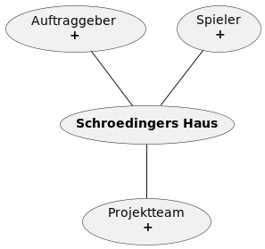

## Umfeldanalyse

|===
|Einflussgröße |Sachlich / Sozial |Einfluss auf Projekt (hoch, mittel, gering) |Einstellung zum Projekt (falls soziale Einflussgröße) (positiv, negativ, neutral)

|Projektteam
|Sozial
|hoch
|positiv

|Auftraggeber
|Sozial
|hoch
|positiv

|Spieler
|Sozial
|hoch
|positiv

|Unternehmen
|Sachlich
|hoch
|

|Andere VR-Projekte
|Sachlich
|mittel
|

|Technische Ausstattung
|Sachlich
|hoch
|

|===

